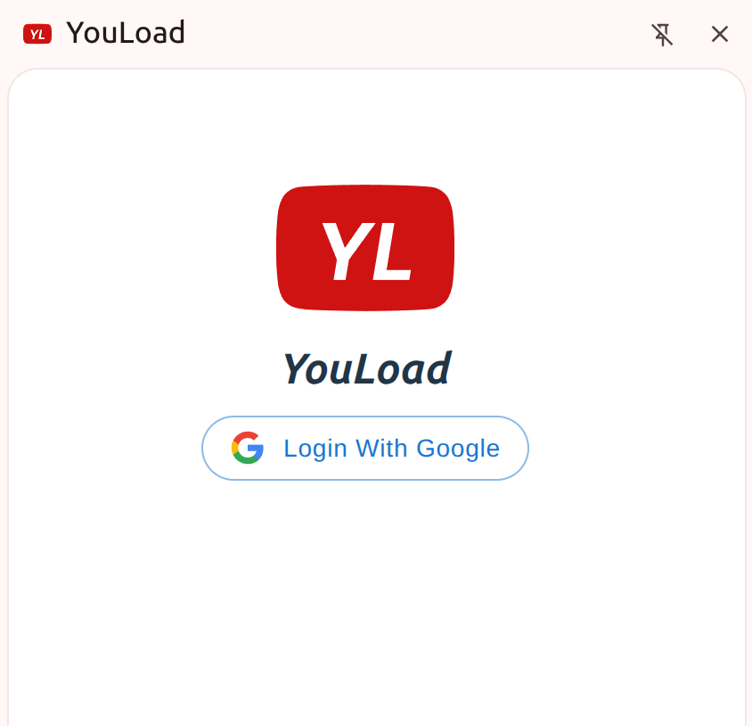
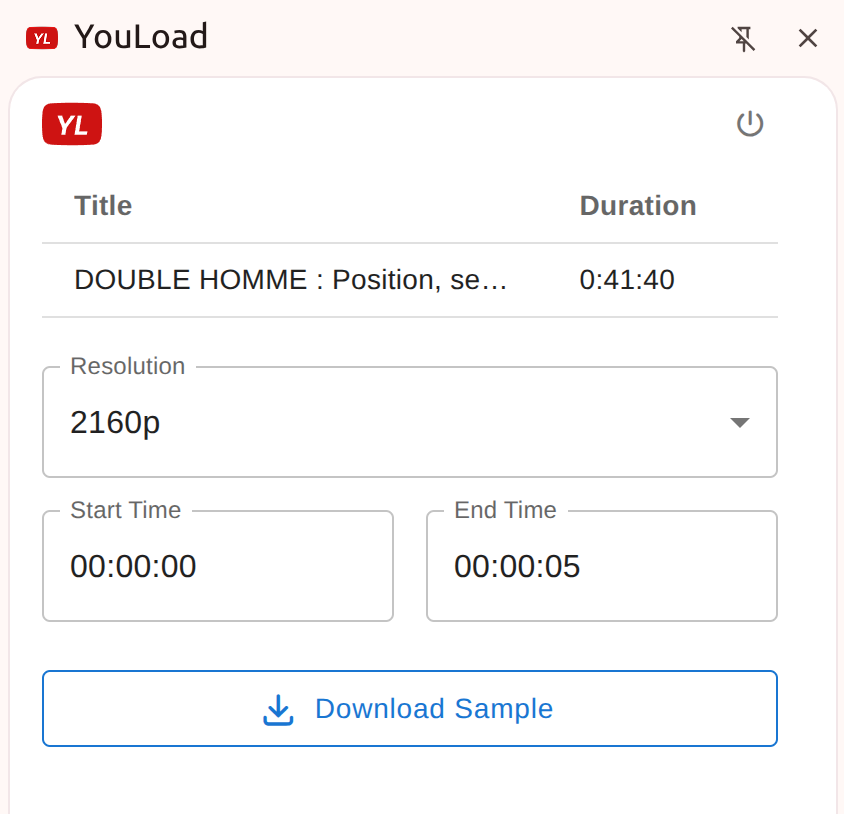
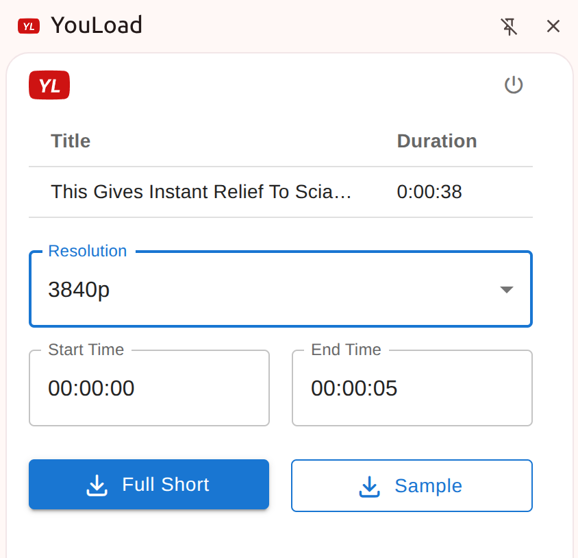

# YouLoad – Chrome Extension for YouTube Video and Shorts Downloads

## Overview

**YouLoad** is a side panel Chrome extension that enables users to download YouTube Shorts and video clips directly from their browser. The extension integrates with an external Python-based service to handle the download process efficiently and securely.

## Key Features

- Download complete YouTube Shorts or selected clips in the available resolution of your choice.
- Extract video samples of up to 3 minutes from any YouTube video.
- Seamless integration with Google Single Sign-On (SSO) for secure access.

## Usage Requirements

- A valid Google account is required to log in via Google SSO.
- Download options include:
  - Full-length Shorts.
  - Short samples from Shorts or standard YouTube videos (up to 3 minutes).

## Previews

## Useful commands

- pnpm dev
- npx wxt build
- npx wxt zip
